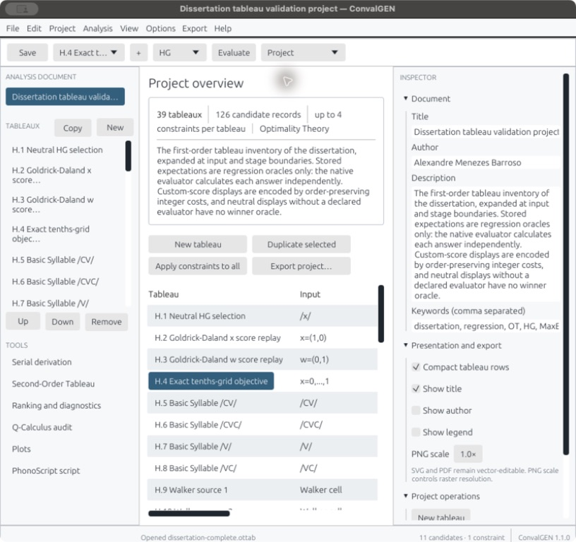
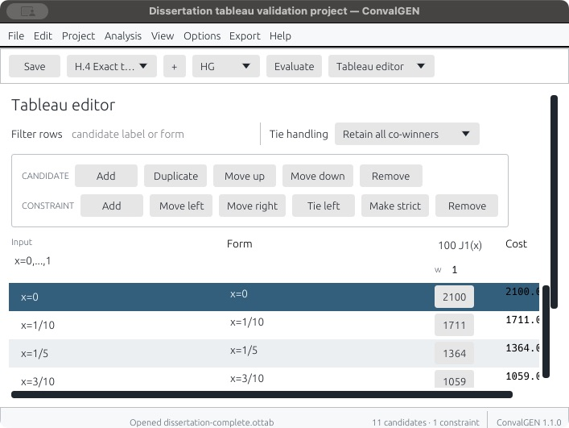
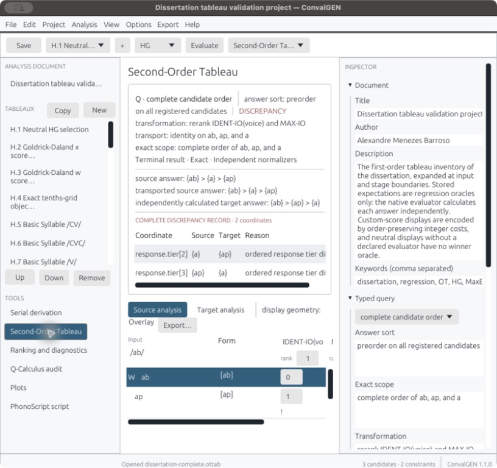
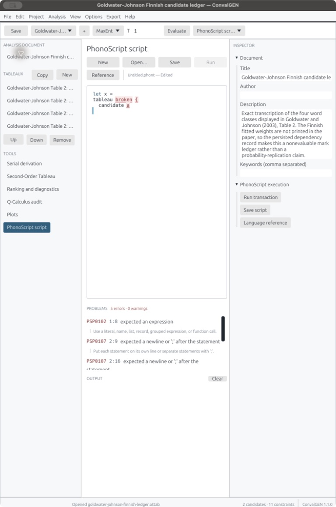
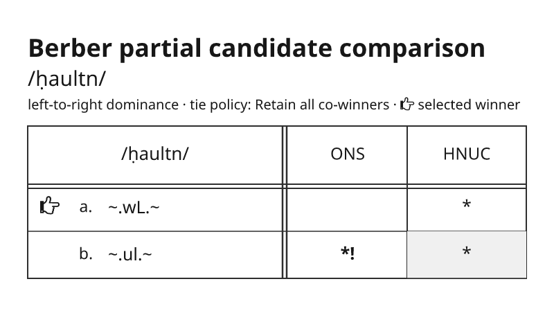
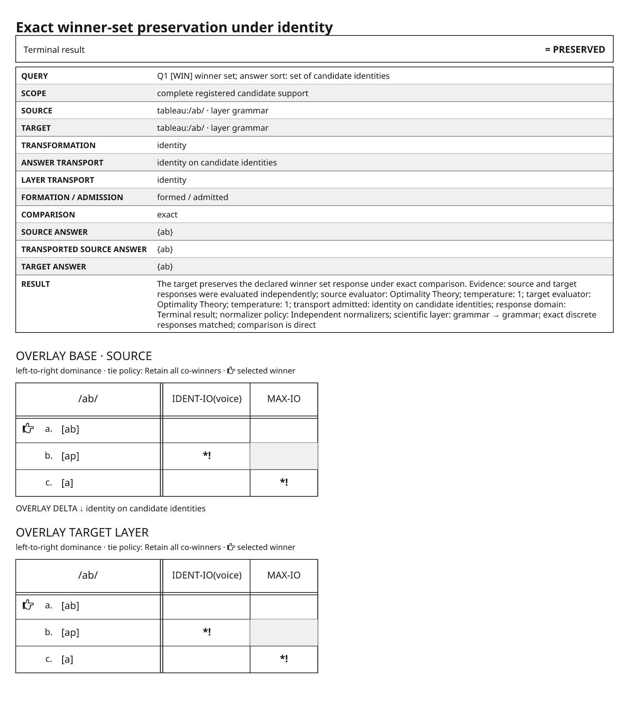
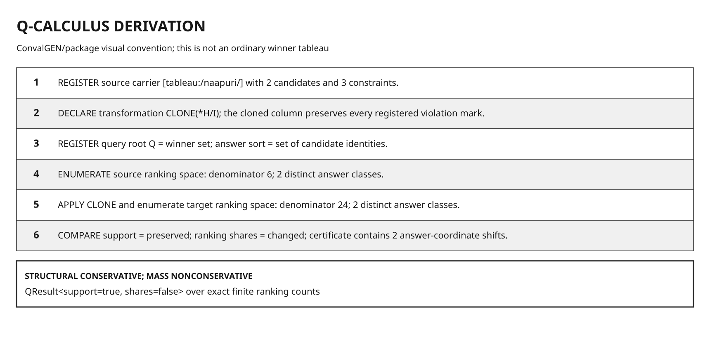

<p align="center">
  
</p>

<h1 align="center">Project PhonoScript</h1>

<p align="center">
  <strong>A language, exact finite-analysis engine, and visual workbench for constraint-based phonology.</strong>
</p>

<p align="center">
  <a href="https://github.com/alexandre-barroso/phonoscript_project/actions/workflows/release.yml"></a>
  <a href="https://github.com/alexandre-barroso/phonoscript_project/releases/latest"></a>
  <a href="LICENSE"></a>
  
</p>

<p align="center">
  <a href="https://github.com/alexandre-barroso/phonoscript_project/releases/latest/download/macos.zip"></a>
  <a href="https://github.com/alexandre-barroso/phonoscript_project/releases/latest/download/windows.zip"></a>
  <a href="https://github.com/alexandre-barroso/phonoscript_project/releases/latest/download/linux.zip"></a>
</p>

Project PhonoScript brings two closely related tools into one repository.
[PhonoScript](#phonoscript) is a standalone scripting language and the shared
phonological engine. [ConvalGEN](#convalgen) is the cross-platform desktop
application built on that engine. A project can therefore be calculated from a
`.phont` script, edited as an `.ottab` document, inspected visually, and
exported without changing evaluators between interfaces.

<p align="center">
  
</p>

<p align="center"><sub>ConvalGEN opening the 39-record dissertation validation project.</sub></p>

## What the project provides

| Component | Role |
|---|---|
| **PhonoScript** | A standalone `.phont` language, command-line interpreter, and reusable Rust engine for declared finite phonological analyses |
| **ConvalGEN** | A graphical project environment for editing, calculating, comparing, plotting, and exporting multi-tableau `.ottab` projects |
| **Shared engine** | Strict OT, Harmonic Grammar, finite MaxEnt, serial OT/HG, typed Second-Order comparison, and bounded Q-Calculus operations |

The dependency is deliberately one-way: ConvalGEN uses the `phonoscript`
crate, while PhonoScript has no dependency on the graphical application. Both
components are currently version **1.1.0**. PhonoScript language version 3 and
`.ottab` schema version 4 are separate compatibility contracts.

### Analysis principles

- **The phonologist controls the ledger.** Every violation count is entered
  explicitly; candidate forms and constraint descriptions never manufacture
  marks.
- **Candidates are not outputs.** Every tableau row is a candidate. “Output”
  refers only to a candidate selected by the evaluator or to a declared serial
  terminal result.
- **Exactness boundaries are visible.** Integers, rationals, weighted costs,
  and exact finite-law operations remain exact where their inputs permit it.
  Approximate and grid-based judgments are separate declared modes.
- **Incomplete comparisons remain incomplete.** Missing support, transport,
  normalizer policy, scientific-layer bridge, serial ledger, or violation
  count produces a structured `NOT EVALUATED` result—not `false`, zero, `NaN`,
  or an empty response.

## Download

Each release archive contains the native ConvalGEN application and a runnable
PhonoScript interpreter, together with the public manuals and validation
material appropriate to that platform.

| Platform | Architecture | Package |
|---|---|---|
| macOS | Apple silicon (`arm64`) | [Download `macos.zip`](https://github.com/alexandre-barroso/phonoscript_project/releases/latest/download/macos.zip) |
| Windows | x86-64 | [Download `windows.zip`](https://github.com/alexandre-barroso/phonoscript_project/releases/latest/download/windows.zip) |
| Linux | x86-64 | [Download `linux.zip`](https://github.com/alexandre-barroso/phonoscript_project/releases/latest/download/linux.zip) |

Release packages are native archives rather than store installers. Consult the
[release notes](https://github.com/alexandre-barroso/phonoscript_project/releases/latest)
for the signing and packaging status of a particular build.

## PhonoScript

PhonoScript is both an executable language and the API boundary shared with
ConvalGEN. It provides source-located diagnostics, functions, control flow,
collections, local modules, structured phonological data, project mutation,
evaluation, assertions, Second-Order operations, and Q-Calculus commands.

A complete strict-OT tableau can be declared and checked directly:

```phont
#!/usr/bin/env phonoscript

project_title("Final voicing")
project_evaluator("OT")
dataset_clear()

tableau_select("source")
tableau_name("Final voicing")
tableau_input("/bɛd/")
constraints_clear()
candidates_clear()

constraint_add("*VOICED-CODA", 1, "", 0)
constraint_add("IDENT-IO(voice)", 1, "", 1)

candidate_add("faithful", "[bɛd]", [1, 0])
candidate_add("devoiced", "[bɛt]", [0, 1])

assert_winners(["devoiced"])
```

Run it like any other script:

```bash
phonoscript analysis.phont
phonoscript --check analysis.phont
phonoscript analysis.phont --base project.ottab --write result.ottab
```

Install the interpreter from a source checkout with Rust 1.88 or newer:

```bash
cargo install --locked --path phonoscript --bin phonoscript
```

Local `.phont` modules support selective imports. Imports are canonicalized
under an explicit module root, and imported files are declaration-only unless
the entry script explicitly calls an exported function. There is no remote
code loading or package registry.

```bash
phonoscript --module-root analyses analyses/main.phont
```

The full grammar, runtime model, standard library, command reference, module
rules, and diagnostic catalogue are documented in the
[PhonoScript Language and Engine Manual](docs/PhonoScript-Language-Manual.pdf).

## ConvalGEN

ConvalGEN supplies direct table editing and a coordinated set of workspaces for
large phonological projects. It supports multiple tableaux per project,
ranking and candidate reordering, declared tie policies, unset violation
cells, serial derivations, typed comparisons, Q-Calculus, plots, keyboard
editing, responsive scrolling, and native publication export.

<table>
  <tr>
    <td width="50%"></td>
    <td width="50%"></td>
  </tr>
  <tr>
    <td align="center"><sub>Direct tableau editing</sub></td>
    <td align="center"><sub>Typed Second-Order discrepancy</sub></td>
  </tr>
</table>

The embedded PhonoScript editor uses the same parser and runtime as the
standalone interpreter, with token-aware highlighting and source-located
diagnostics.

<p align="center">
  
</p>

<p align="center"><sub>PhonoScript diagnostics inside ConvalGEN.</sub></p>

### Publication output

ConvalGEN exports cropped SVG, PDF, and PNG from one native vector scene. SVG
remains editable, PDF retains vector text and embedded fonts, and PNG uses an
explicit canvas and declared scale. The renderer implements the material
visual grammar of the bundled `secondordertableau.sty` package without
emitting `.tex` files.

<table>
  <tr>
    <td width="33%"></td>
    <td width="33%"></td>
    <td width="33%"></td>
  </tr>
  <tr>
    <td align="center"><sub>Strict OT</sub></td>
    <td align="center"><sub>Second-Order comparison</sub></td>
    <td align="center"><sub>Q-Calculus</sub></td>
  </tr>
</table>

Build and open ConvalGEN from source:

```bash
cargo run --release -p convalgen
```

See the [ConvalGEN User Guide](docs/ConvalGEN-User-Guide.pdf) for installation,
project editing, shortcuts, calculation, scripting, and export workflows.

## Typed comparison and Q-Calculus

Second-Order comparison calculates the source and target responses
independently and only then applies the declared transport. The current direct
query interface covers five response families:

1. winner set;
2. surface winner set;
3. complete order;
4. probability law; and
5. candidate support.

These may be evaluated over terminal results or complete serial trajectories,
subject to each query's formation and admission requirements. A completed
comparison returns `PRESERVED` with a certificate, `DISCREPANCY` with all
differing response coordinates, or `NOT EVALUATED` with indexed missing
dependencies. This is an implemented finite interface, not a claim that every
Second-Order theorem in the dissertation has been mechanized.

Q-Calculus currently has registered executable semantics for strict OT with
retained co-winner sets, no project-level a-priori ranking relations, aligned
finite constraint registers, 1–60 enabled constraints, and at most 63
candidates per tableau. Counts and reduced ranking shares use exact
arbitrary-precision integers and rationals. The default dynamic-program budget
is 2,000,000 charged states; exhaustion is a structured refusal rather than an
approximate count. A ranking share is not a token probability unless a further
measure and response law are declared.

The mathematical contract, proofs, algorithms, admissibility rules, and worked
use are collected in the
[Q-Calculus Mathematical and Analyst Manual](docs/Q-Calculus-Manual.pdf).

## Verification

The release gate runs formatting, linting, the complete workspace test suite,
performance checks, and native packaging on macOS, Windows, and Linux.

```bash
cargo fmt --all -- --check
cargo clippy --workspace --all-targets --all-features --locked -- -D warnings
cargo test --workspace --locked --all-targets
cargo run --release -p phonoscript --bin qcalc-bench
```

The current suite contains **247 tests**, executes **24 public `.phont`
analyses**, validates **9 `.ottab` fixtures**, and checks **39 bounded
dissertation records**. Discovery-based harnesses decode every checked-in
project, execute every authored validation script transactionally, and compare
independent native, scripted, and document transcriptions where all three
exist. The performance gate separately exercises exact ranking-space counting,
50,000 finite-MaxEnt evaluations, and 20,000 complete typed comparisons.

Passing these tests establishes the tagged finite records and software
properties. It does not establish exhaustive coverage of the literature,
completeness of a user-declared `GEN`, empirical warrant, historical priority,
or equality over an undeclared continuous domain. The project does not provide
a general continuous-HG optimizer, KKT or persistence certificate, or
contact/inversion solver.

## Repository map

```text
project_phonoscript/
├── phonoscript/     language, interpreter, engine, fixtures, and tests
├── convalgen/       desktop application, packaging, and validation project
├── docs/            public manuals and README media
├── .github/         cross-platform release workflow
└── Cargo.toml       shared Rust workspace
```

## Developer, license, and citation

Project PhonoScript is created and maintained by
[Alexandre Menezes Barroso](https://alexandrebarroso.com), its current sole
developer.

A useful bug report includes the version, operating system and architecture,
the smallest self-contained `.phont` or `.ottab` reproduction, the calculated
result, and the expected result with its mathematical or scholarly basis.
[Open an issue](https://github.com/alexandre-barroso/phonoscript_project/issues/new)
for reproducible defects and focused proposals. Remove confidential research
data before sharing a project. Suspected security issues should be reported
privately through [alexandrebarroso.com](https://alexandrebarroso.com).

Project PhonoScript is free and open-source software under the
[MIT License](LICENSE). Copyright © 2026 Alexandre Menezes Barroso. Citation
metadata is available in [`CITATION.cff`](CITATION.cff).
